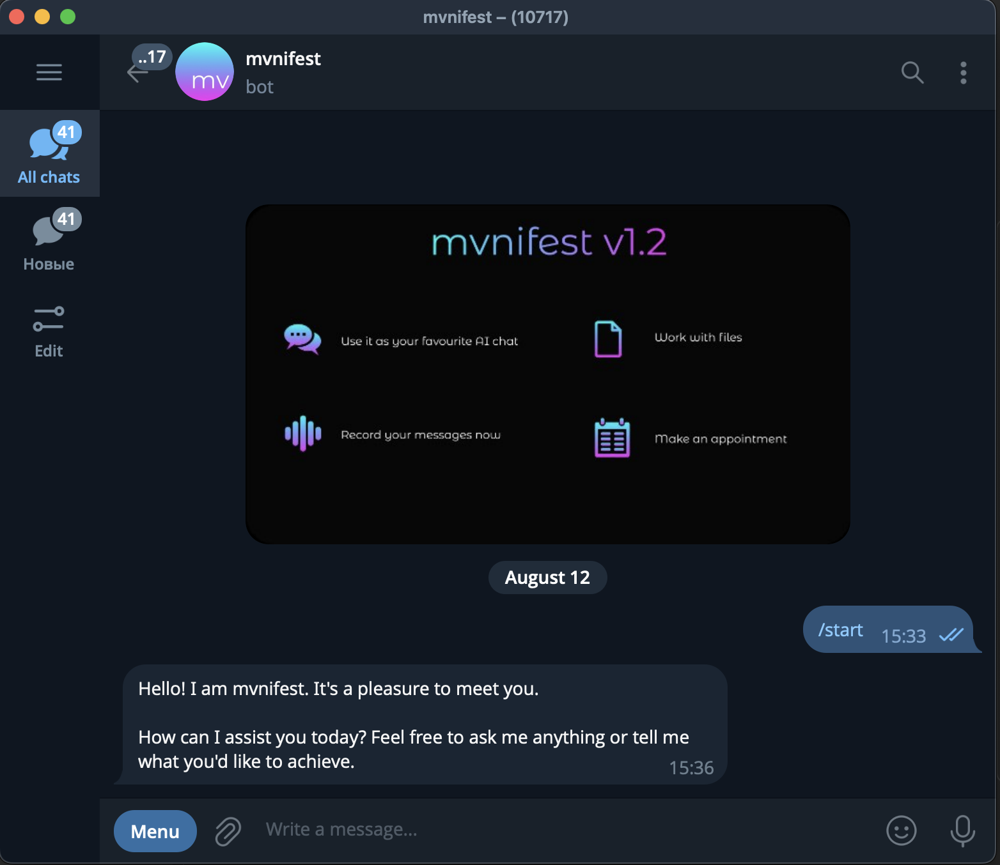
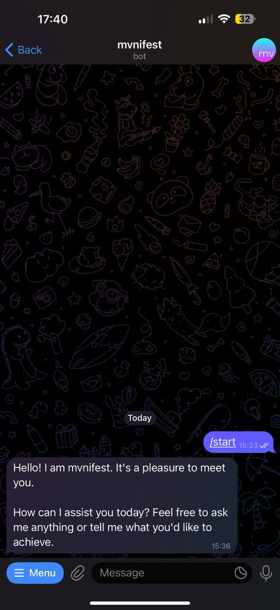
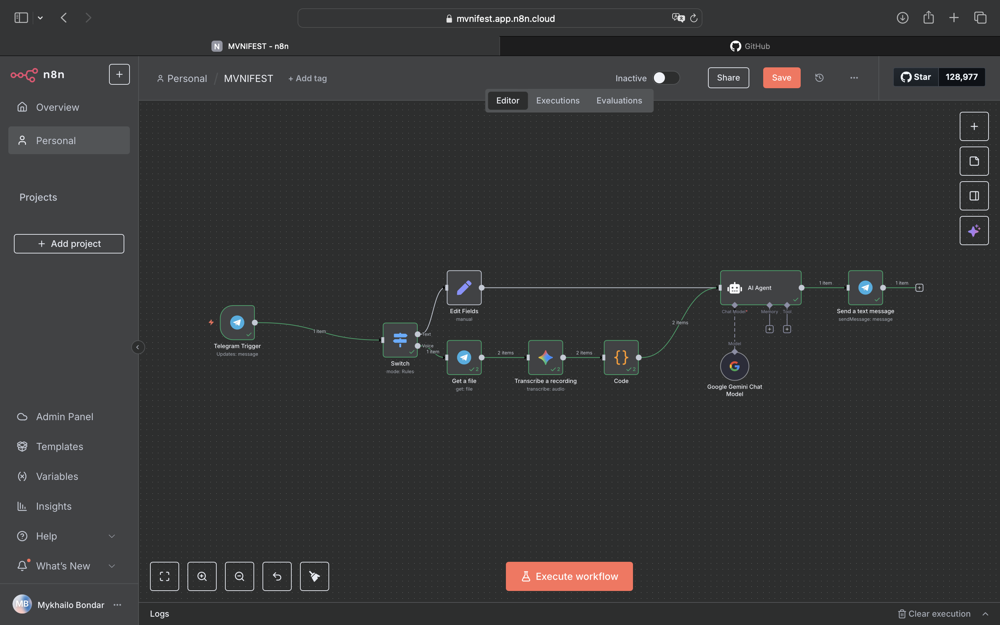

# mvnifest AI Bot 🤖✨

An intelligent Telegram bot built with n8n that bridges conversational AI with Google Workspace automation. Handles natural dialogues while creating/updating Google Sheets on demand.

## 🌟 Key Features
- **Natural chat interface** (greetings, Q&A, context-aware replies)
- **Google Sheets integration** (auto-creates spreadsheets, logs user data)
- **Multi-platform control** (manage via Telegram mobile/desktop + n8n dashboard)
- **Slack notifications** (optional alerts for new interactions)

## 🖼️ Screenshots

| Telegram Desktop | Telegram Mobile | n8n Workflow |
|------------------|-----------------|--------------|
|  |  |  |

## ⚙️ Tech Stack
- **Core**: n8n workflow automation
- **Integrations**: 
  - Telegram Bot API
  - Google Sheets API
  - Slack Webhooks (optional)
- **Hosting**: Ngrok (dev) / VPS (prod)

## 🚀 Quick Start
1. Clone this repository
2. Import `manifest-bot.json` to n8n
3. Configure your:
   - Telegram bot token
   - Google OAuth credentials
   - Slack webhook (optional)
4. Activate workflow!

## 📜 Use Cases
✔ Lead generation forms  
✔ Event registrations  
✔ Customer feedback collection  
✔ Personal task manager  

> **Note**: Requires n8n v1.0+ and Telegram bot token from [@BotFather](https://t.me/botfather)

---
